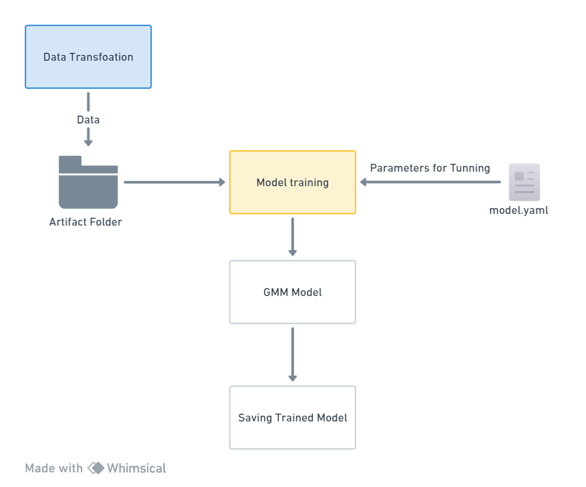

# Problem Description

Customer Personality Analysis based on purchasing power aims to understand the income levels, spending behavior, and affordability of different customer segments. This analysis helps businesses develop more effective marketing strategies by identifying high-potential customer groups with stronger purchasing power, optimizing marketing efforts, and increasing revenue.

### Data Details

#### People
- **ID:** Customer's unique identifier
- **Year_Birth:** Customer's birth year
- **Education:** Customer's education level
- **Marital_Status:** Customer's marital status
- **Income:** Customer's yearly household income
- **Kidhome:** Number of children in the customer's household
- **Teenhome:** Number of teenagers in the customer's household
- **Dt_Customer:** Date of customer's enrollment with the company
- **Recency:** Number of days since the customer's last purchase
- **Complain:** 1 if the customer complained in the last 2 years, 0 otherwise

#### Products
- **MntWines:** Amount spent on wine in the last 2 years
- **MntFruits:** Amount spent on fruits in the last 2 years
- **MntMeatProducts:** Amount spent on meat in the last 2 years
- **MntFishProducts:** Amount spent on fish in the last 2 years
- **MntSweetProducts:** Amount spent on sweets in the last 2 years
- **MntGoldProds:** Amount spent on gold in the last 2 years

#### Place
- **NumWebPurchases:** Number of purchases made through the company’s website
- **NumCatalogPurchases:** Number of purchases made using a catalogue
- **NumStorePurchases:** Number of purchases made directly in stores
- **NumWebVisitsMonth:** Number of visits to the company’s website in the last month

#### Target
Form relevant customer segments based on purchasing power and income 

#### Data Source
[Kaggle](https://www.kaggle.com/datasets/imakash3011/customer-personality-analysis)

###  Customer Segmentation based on purchasing power 
Categorizing customers based on income levels provides invaluable insights into the purchasing power of different segments. According to the analysis:

#### Customer Segments
**a. High Income, High Amount Spent: "Affluent Customers" or "High-Spending Clients"**

**Description:** These customers have high incomes and spend a substantial amount of money on their purchases. They are affluent and valuable customers, making them a prime target for special treatment and personalized offers to maintain their loyalty and increase their spending.

**b. Moderate Income, Moderate Amount Spent: "Middle-Income Customers" or "Steady Spenders" - Potentially Good Customer**

**Description:** These customers have moderate incomes and spend an average amount on their purchases. They show consistent spending behavior and should be encouraged to increase their loyalty. Nurturing them may lead to becoming higher-value customers over time.

**c. Low Income, Low Amount Spent: - Average Customers**

**"Budget-Conscious Customers" or "Economical Buyers"**

**Description:** These customers have low incomes and spend relatively little on their purchases. Targeted marketing efforts should focus on offering affordable products or services to attract them and improve their loyalty.

## UI 

## Cluster 

## Batch Prediction 

## Project Overview 
1. **Feature Engineering:**
   Engineer relevant features from collected data to enhance model prediction accuracy.

2. **PCA Analysis:**
   Apply Principal Component Analysis (PCA) to understand dataset variance and identify key features contributing to income prediction. This step aids in dimensionality reduction, boosting model performance.

3. **Clustering with Machine Learning Models:**
   Utilize clustering algorithms (e.g., K-means,Gaussian Mixture Model) on PCA-transformed features to segment customers based on income patterns. 

4. **Model Training and Validation:**
   Traineg machine learning models on  data to predict customer clusters based on infome and other available factors. 

5. **UI for User Interaction:**
   Developed  a user-friendly interface for stakeholders to interact with trained models and cluster labelling.

### Model 

**Gaussian Mixture Model**
A Gaussian Mixture Model (GMM) is a probabilistic model that represents a mixture of multiple Gaussian (normal) distributions. 
In the context of clustering, GMM assumes that the data points are generated from a mixture of several Gaussian distributions with unknown parameters. Each Gaussian distribution in the mixture represents a cluster, and a data point can belong to any of the clusters with a certain probability.

**Number of Clusters** - 3 
**Elbow Method**

**Metric** 
**Silhouette Score**:
It  how well-separated clusters are, providing insight into the cohesion and separation of data points within the clusters. The score ranges from -1 to 1, where a higher score indicates better-defined clusters.

score obtained - 0.40 - 0.55 

## Training Pipeline 

#### Data Ingestion 

Data Ingestion class represents a data ingestion process that involves retrieving data from a data source, saving it in a raw data directory, and splitting it into training and test datasets. 
The class code flows in following way:
Data Ingestion class takes a necessary elements and that provides the configuration settings for the data ingestion process.

#### Data Validation 

This method is designed to validate the training and test data stored in the artifact folder, resulting from the earlier data ingestion process. Its primary responsibility is to perform validation checks on both the training and test datasets.

The validation process consists of the following steps:

1. **File Name Validation:**
   - Validates the file name of the downloaded dataset.

2. **Column Labels Validation:**
   - Ensures the correctness of column labels.

3. **Data Types Validation:**
   - Validates the data types in the datasets.

4. **Missing Values (Whole Column) Validation:**
   - Checks for missing values in entire columns.

5. **Replace Null Values:**
   - Replaces null values in the dataset.

Each of these validation processes returns a boolean value as the result. If the dataset passes all the checks and evaluates to True, it is considered successfully validated. The method logs the validation process and, upon success, exports the validated datasets to specified paths, returning the paths. However, if the validation fails at any step, the method raises an exception.

#### Data Transformation

Once the validated data is obtained from the artifact folder, it undergoes necessary transformations before being used for model training. These transformations ensure that the data is in a suitable format and structure for the training process.

##### Feature Engineering

The Feature Engineering class leverages insights from exploratory data analysis (EDA) to transform the dataset, enriching it with new and meaningful information. The engineered features have the potential to improve the model's performance and predictive capacity.

To ensure consistent utilization of these features, a feature engineering object file is created. This allows for batch prediction on new data without repeating the entire feature engineering process. This approach promotes consistency, reproducibility, and efficient application of preprocessing steps to the data.

##### Preprocessing Pipeline

After feature engineering, the next step is the preprocessing pipeline. This pipeline applies a series of steps to the training and testing datasets, ensuring they are in a consistent and suitable format for model training.

The preprocessing pipeline plays a critical role in optimizing the data for model training by standardizing and cleaning it. This enables the model to learn patterns effectively during training and make accurate predictions.

Overall, the data transformation stage ensures that the validated data undergoes necessary transformations, while feature engineering enhances the dataset by creating new features. The preprocessing pipeline then applies a series of standardized steps to prepare the data for model training.

### Model Trainer 

The best model, along with its corresponding best parameters, is saved for future use. This ensures that the optimal model can be easily retrieved and applied to new data.

#### Model Evaluation 
The saved model directory may contain earlier models and other necessary components from previous iterations. 
During the evaluation process, we compare the recently trained artifact model with the previously saved models. By leveraging this comparison, we identify the best-performing model.
Chosen model along with its associated model object and model report. 
This approach ensures that we retain the most optimal model for future use.

#### Model Pusher 

Upon selecting the models and gathering the relevant information from the evaluation module, we proceed to push the chosen model and its corresponding report to the saved model directory. This ensures that the selected model is readily available for future prediction processes.